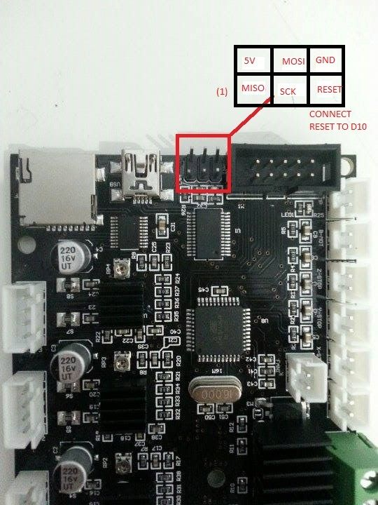

# Ender 3 configuration / notes 

You can use these as a baseline for your configuration.

What's here:

- Marlin 1.1.9 configuration
- Slic3r Prusa Edition profiles
- My gcode post processors

The following steps should also be done to get better prints and a more enjoyable machine:

## Calibrate your extruder

https://www.youtube.com/watch?v=YUPfBJz3I6Y

**The extruder may not skip any steps!** If so, there are probably obstructions in the filaments path:

    1. Remove and clean the nozzle, using brush and needle
    2. Heat nozzle up using a soldering iron
    3. Manually push through some filament
    4. Remove soldering iron and let the nozzle cool down a bit
    6. Retract filament while filament is still glassy (a manual "cold" pull)

Always fasten the nozzle when it's hot, and let the nozzle push the bowden tube back up.

Update the values in ``Marlin/Configuration.h``. The stock setting is 93, I calibrated mine and came up with 98.

```c++
#define DEFAULT_AXIS_STEPS_PER_UNIT   { 80, 80, 400, 98 }
```

## Update the firmware

Flashing the bootloader can be a bit scary but that's about all there is to it.

https://www.youtube.com/watch?v=fIl5X2ffdyo

https://www.youtube.com/watch?v=oZVTYpHnpIw

You can connect either ``PIN 10, 11, 12, 13`` on the programmer Arduino Uno to the ICSP on the ender mainboard, or use the ICSP pins on the Uno.

MOSI | MISO | SCK | RESET
---- | ---- | --- | -----
11 | 12 | 13 | 10
ICSP-4 | ICSP-1 | ICSP-3

Source: https://www.arduino.cc/en/Tutorial/ArduinoISP

Mainboard of Ender 3:



Because of a lack of female-to-female jumper cables I used the pins on my Arduino Uno.

## Post processors

All of the post processors are written in Python. You should have at least Python 3.7.0 installed. And then the pyinstaller package should be installed on Windows:

```
pip install pyinstaller
```

Then you can use `compile.bat` and  `install.bat` to create the post processor executables. (They are only tested on windows)